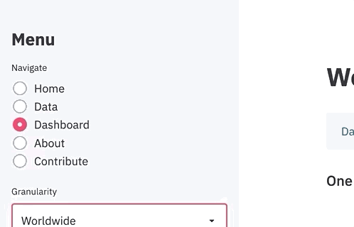
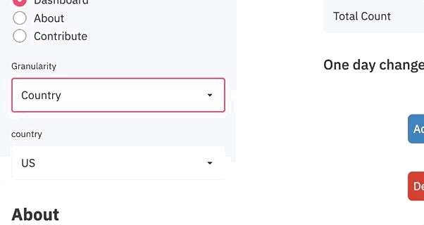

# covid-dashboard


A Coronavirus Dashboard that updates information realtime using [Streamlit](https://www.streamlit.io/) as the primary UI engine.


 

## Overview

All Covid resources and data at one place so that visitors can get all information regarding Covid facts.
Vaccine tracker and information available regarding the vaccine availability can also be tracked
All helping resources can be added to website in emergency times 

```python
import streamlit as st

st.sidebar.radio("Navigate", 
                 ["Home", "Data",
                  "Dashboard", "About"])
```


Similarly, one can create dropdowns, checkboxes and a bunch of other UI designs.
 ```python
import streamlit as st

st.sidebar.selectbox("Granularity", ["Worldwide", "Country"])

```


The graphs were created using plotly. Since streamlit supports multiple graphical libraries, rendering plotly 
chart were very easy. Just pass the plotly figure object into the `st.plotly_chart()` function.

```python
import streamlit as st
import plotly.express as px

fig = px.bar(x=df["X"], 
             y=df["Y"])

st.plotly_chart(fig)
```


## How to run

Clone the repository and install dependencies:

```shell script
pip3 install -r requirements.txt
```

Run the app using streamlit

```shell script
streamlit run app.py
```


## About

* [Github](https://github.com/raunakvasistha)
